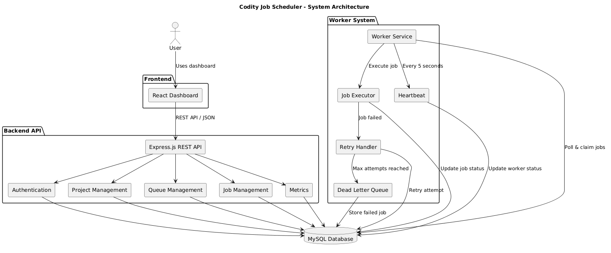
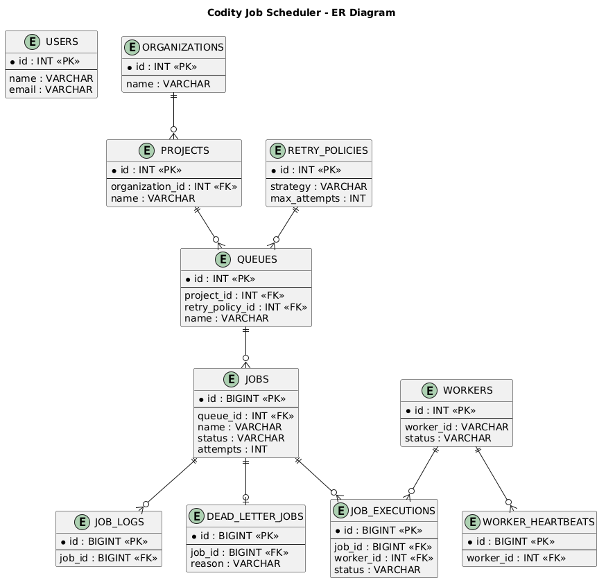

# Codity Job Scheduler

A distributed background job scheduling platform with a REST API, worker service, and a React dashboard for monitoring jobs, queues, and workers.

## Features

- Job creation & scheduling
- Queue management with pause/resume
- Background job processing via a dedicated worker service
- Job retries — fixed, linear, and exponential strategies
- Dead Letter Queue (DLQ) for jobs that exceed max attempts
- Worker registration, heartbeats, and status monitoring
- Dashboard metrics and job execution tracking

## Tech Stack

| Layer | Technology |
|---|---|
| Frontend | React, Vite, Axios |
| Backend | Node.js, Express.js, JWT |
| Database | MySQL |
| Worker | Node.js |

## Architecture



- **React Dashboard** — monitor jobs, queues, and workers
- **Express API** — auth, projects, queues, jobs, metrics
- **Worker Service** — claims jobs, handles retries, sends heartbeats
- **MySQL** — shared database for API and worker

## Database Schema



Core tables: users, organizations, projects, queues, jobs, retry policies, workers, job executions, job logs, dead letter jobs, worker heartbeats.

## Job Lifecycle

```text
Create Job
    ↓
Queue
    ↓
Worker Claims Job
    ↓
Execute
    ↓
 ┌───────────┴───────────┐
Success               Failure
   ↓                      ↓
COMPLETED                Retry
                          ↓
                  Max Attempts?
                    ↓        ↓
                   No        Yes
                   ↓          ↓
                Retry        DLQ


## Project Structure

```text
codity-job-schedular/
│
├── backend/
├── frontend/
├── worker/
├── docs/
│   ├── architecture.png
│   └── ER2.png
│
└── README.md

## Getting Started

Make sure MySQL is running and configured before starting the services.

**1. Backend**
```bash
cd backend
npm install
npm start
```

**2. Worker**
```bash
cd worker
npm install
npm start
```

**3. Frontend**
```bash
cd frontend
npm install
npm run dev
```